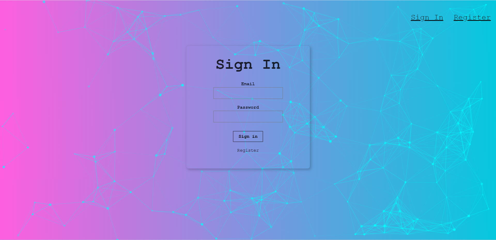
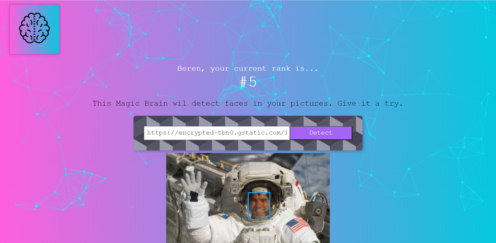

# 🧠Smart Brain Project

Project is based on face detection on a picture which of the url is used.
Clarifai API is used for face detection.

# Built with

- JavaScript, React(v18.2)
- particles-bg, react-parallax-tilt are used as react components.
- tachyons is used as CSS framework

# Reach Smart Brain Website

You need to follow these to get the project
1-Clone this repo
2-In the project directory, you can run `npm install`
3-Run `npm start`

You can reach the project here, [smartbrain](https://smartbrainberen.netlify.app/)

# Visual of the project

# Acknowledgments

Project is built during the course in Udemy.
The Complete Web Developer in 2023: Zero to Mastery by Andrei Neagoie.
