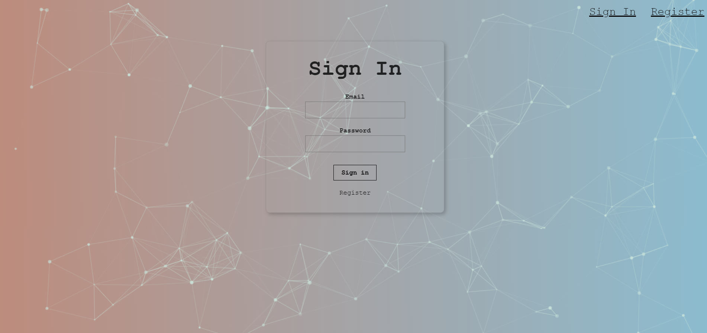
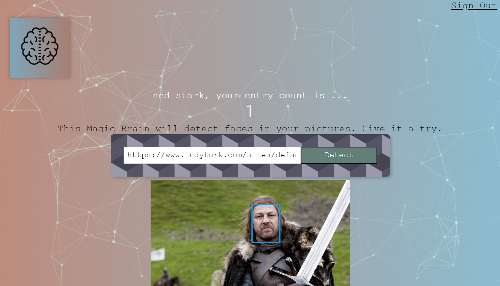

# 🧠Smart Brain Project- Frontend & Backend

The project is based on face detection in a picture using the Clarifai API

# Built with

Utilized React for the frontend development, and Node.js used along with Express.js for building the backend infrastructure

# Reach Smart Brain Website

You need to follow these to get the project
1-Clone the repo
2-In the project directory, you can run `npm install`
3-Run `npm start`

You can reach the project here, [smartbrain](https://smartbrain-7m7t.onrender.com/)

# Visual of the project

# Acknowledgments

The project was built during the course 'The Complete Web Developer in 2023: Zero to Mastery' on Udemy, instructed by Andrei Neagoie.
